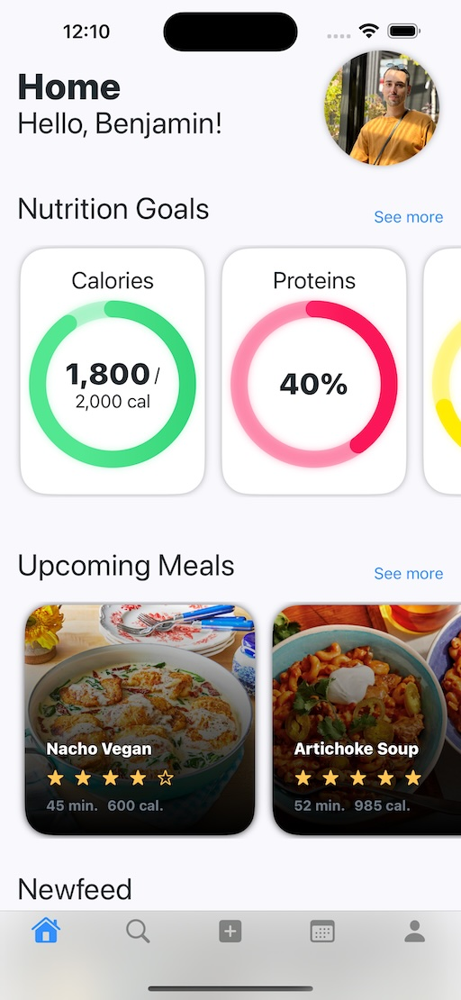

# FlavorShare

FlavorShare is an innovative iOS app designed to enhance your culinary experiences by sharing and discovering recipes. With an intuitive interface and rich features, Flavorshare is your go-to app for all things related to cooking and recipes.

## Screenshots

Explore the app through the following screenshots. Click on the images to view them in full size.

### App Icon


### Welcome View


### Login View


### Register View


### Home Screen View


### Profile View


### Explore View


### Recipe View View


## DB
- **Firebase

## Features

- **User Authentication**: Secure login and registration system.
- **Recipe Sharing**: Share your favorite recipes with the community.
- **Recipe Discovery**: Browse and search for recipes.
- **Profile Management**: Customize and manage your profile.
- **Favorites**: Save your favorite recipes for quick access.
- **Personalized Recommendations**: Get recipe suggestions based on your preferences.

## Roadmap

### Completed

- [x] App Icon Design
- [x] Welcome Page
- [x] User Authentication (Login/Registration)
- [x] Home Screen Implementation
- [x] Profile Management
- [x] Recipe Sharing and Discovery
- [x] Basic Search Functionality
- [x] Recipe View with Detailed Information

### To Do

- [ ] Advanced Search Filters
- [ ] User Feedback System
- [ ] Recipe Ratings and Reviews
- [ ] Integration with Social Media
- [ ] Dark Mode Support
- [ ] Performance Optimization
- [ ] Additional Recipe Categories

## Getting Started

To get started with Flavorshare, follow these steps:

1. **Clone the Repository**:
    ```bash
    git clone https://github.com/yourusername/flavorshare.git
    ```

2. **Navigate to the Project Directory**:
    ```bash
    cd flavorshare
    ```

3. **Install Dependencies**:
    ```bash
    pod install
    ```

4. **Open the Project**:
    Open `Flavorshare.xcworkspace` in Xcode.

5. **Build and Run**:
    Build and run the project on a simulator or a physical device.

## Contact

For any questions or feedback, please reach out to us at [benjamin.lefebvre.1024@gmail.com](mailto:benjamin.lefebvre.1024@gmail.com).
