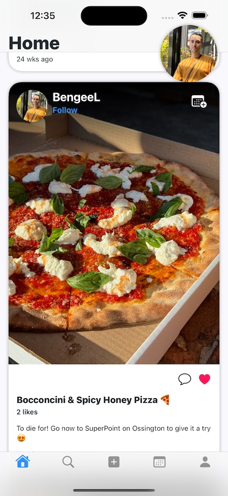
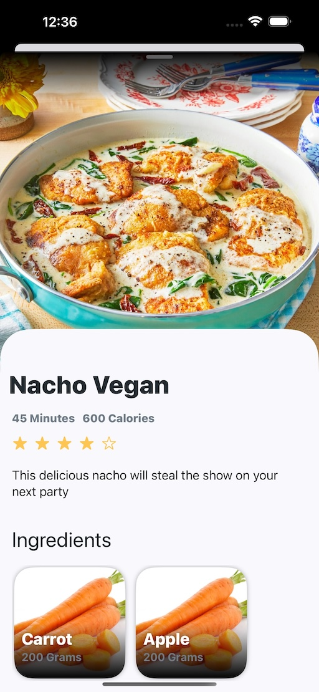
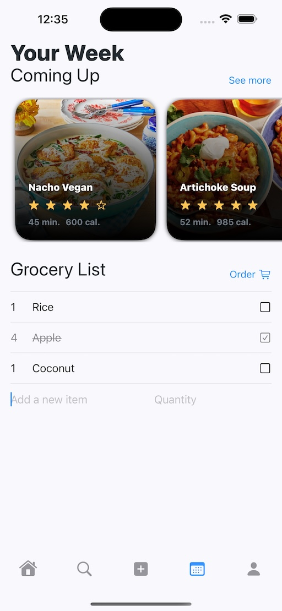
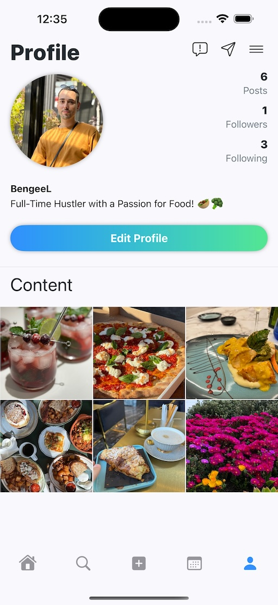

# FlavorShare

FlavorShare is an innovative iOS app that enhances your culinary experiences by sharing and discovering recipes. With an intuitive interface and rich features, Flavorshare is your go-to app for all things related to cooking and recipes.

**Flavorshare is my very first iOS app, created during my free time as I learned and experimented with iOS development. I’m incredibly proud of what I’ve achieved so far and excited to share it with you.** 

## Features
### Implemented
- **User Authentication**: Secure login and registration system using Firebase Authentification.
- **Newsfeed**: Keep yourself updated with what is happening within the community.
- **Post Sharing**: Share your favourite food post with the community.
- **Recipe Sharing**: Interact with the shared content using likes & comments.
- **Grocery List**: Create & manage your grocery list.
- **Profile Management**: Customize and manage your profile.
- **Search/Follow**: Use Explore to find your friends and follow them.
- **Recipe View**: See the instructions on a published recipe.

### Coming Up
- **Third-Party Login**: Connect using Google, Apple or Facebook.
- **Recipe Sharing**: Share your favourite food recipe with the community.
- **Weekly Meal Planning**: Add the recipes you want to cook throughout your week.
- **Auto Generated Grocery List**: Based on your weekly meal plan, update your grocery list with the required items.
- **Recipe Discovery**: Browse and search for recipes based on cuisine type, cooking time, ratings, etc.
- **Personalized Recommendations**: Get recipe suggestions based on your preferences.
- **Favorites**: Save your favourite recipes for quick access.
- **Track your nutrition intake**: Get details (calories, fat, proteins, carbs and more.) on your daily food and compare them with your set targets.
- **AI Nutritionist**: Get advice from our AI nutritionist about your current diet.
- **Chat**: Stay in touch with your friends by sharing and writing to them via the chat functionality.

## Screenshots

The following screenshots explore the app's latest UI. Click on the images to view them in full size.

### App Icon


### Welcome View


### Login View


### Register View


### Home Screen View



### Recipe View View


### Explore View


### Your Week View
  

### Profile View
  


## Database
- **Firebase
- **Firestore

## Getting Started

To get started with Flavorshare, follow these steps:

1. **Clone the Repository**:
    ```bash
    git clone https://github.com/BengeeL/FlavorShare.git
    ```

2. **Open the Project**:
    Open `FlavorShare.xcworkspace` in Xcode.

3. **Build and Run**:
    Build and run the project on a simulator or a physical device.

## Contact

If you have any questions or feedback, please email at [benjamin.lefebvre.1024@gmail.com](mailto:benjamin.lefebvre.1024@gmail.com).
